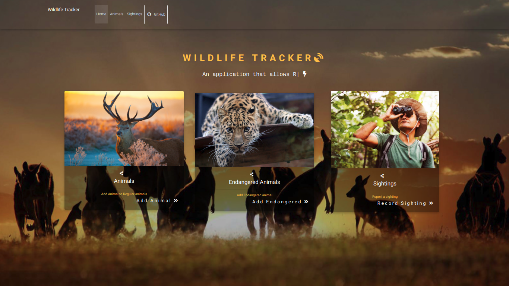

# Wildlife Tracker
#### Wildlife Tracker, 2023
#### By **Racheal Kinyua**


## Description

```bash
An application that allows Rangers to track wildlife sightings in the area.
```

## TOC

- [Installation](#Installation)
- [SQL](#SQL)
- [Tests](#Tests)
- [Requirements](#Requirements)
- [Known Bugs](#Requirements)
- [Extras](#extras)


## Technologies Used
[](https://forthebadge.com)
[](https://forthebadge.com)
[](https://forthebadge.com)

## Installation
* `git clone <https://github.com/rkinyua5/wildlife-tracker.git>` this repository
* `cd wildlife-tracker`

## Tests

- To run test, run files under tests/java package 


## SQL
```bash
1.Launch postgres

2.Type in psql

Run these commands

3. CREATE DATABASE wildlife_tracker;

4. \c wildlife_tracker;

5. CREATE TABLE animals (id serial PRIMARY KEY, name varchar, health varchar, age varchar, type varchar);

6. CREATE TABLE wildlife_tracker=# CREATE TABLE sightings (id serial PRIMARY KEY, animal_id int, location varchar, ranger_name varchar, timestamp timestamp);

7. CREATE DATABASE wildlife_tracker_test WITH TEMPLATE wildlife_tracker;

```
## Requirements
```bash
The applications allow users to do the following:

1.Add a new animal
 
2.Add an endangered animal

3.Add an animal Sighting

```

## Contact Details
```bash
You can contact me at rkinyua5@gmail.com
```

## License
- This project is licensed under the MIT Open Source license Copyright (c) 2019. [LICENCE](https://github.com/rkinyua5/wildlife-tracker/blob/master/LICENCE)

